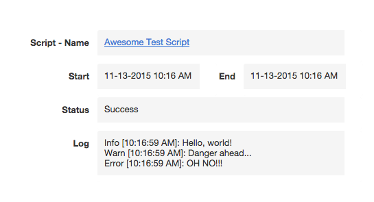
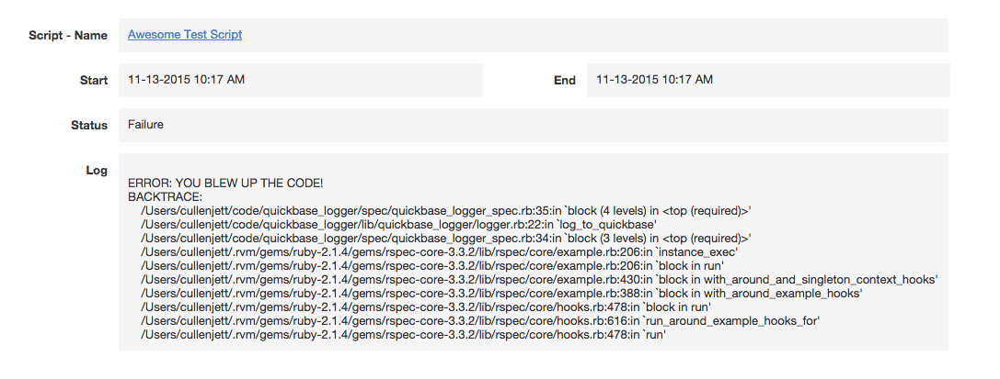

# QuickbaseLogger

"QuickbaseLogger offers a configurable way to use the Intuit QuickBase platform as a way to log Ruby script information."

## Installation

Add this line to your application's Gemfile:

```ruby
gem 'quickbase_logger'
```

And then execute:

    $ bundle

Or install it yourself as:

    $ gem install quickbase_logger

## What is it?
QuickbaseLogger offers a way to wrap your code in a begin/rescue block that will create QuickBase records after the block is finished executing. In addition, it will create a standard ruby Logger instance and write logs to a .log file. It offers a similar API as the standard ruby Logger (i.e. #info, #warn, #error).


## Usage

### Configuration
QuickbaseLogger relies on a certain architechture for the QuickBase application you write logs to -- as of version 0.0.1 you must have **two** tables, a parent Scripts table and a child table for the Script Logs (obviously you can name them whatever you want, it's only the parent-child relationship that's important). In the Script Logs child table there are a handful of fields that QuickbaseLogger will write to (i.e. you need these fields in your Script Logs child table):
- 'Start' -- A DateTime field that defines when the script started running.
- 'End' -- A DateTime field that defines when the script finished running.
- 'Logs' -- A Multi-line Text field that will capture any .info(message) calls and the backtrace for exceptions.
- 'Status' -- A Text field that will either be populated with 'Success' or 'Failure' based on if any exceptions are thrown during the script's execution.
- 'Related Script' -- The [Record ID#] of the parent script.

**Note that the names you give the fields in the .define_fields configuration block need to match the names above (the lowercase version, of course). See below for an example.**

QuickbaseLogger is built on top of the wonderful [QuickbaseRecord](https://github.com/cullenjett/quickbase_record) gem, and follows a similiar pattern for configuration.

```ruby
  # config/initializers/quickbase_logger.rb

  QuickbaseLogger.configure do |config|
    # same config as QuickbaseRecord
    config.realm = "quickbase_app_realm_name"
    config.username = "valid_username"
    config.password = "valid_password"
    config.token = "quickbase_app_token_if_applicable"

    # new config options specific to QuickbaseLogger
    # .logger_path -- the path to where text logs will write to.
    # NOTE: this is required as of version 0.0.1 (it will default to /log, but your app may not follow that pattern and this could cause some headache if not defined here)
    config.logger_path = "/log"

    # .define_fields -- just a proxy for the method of the same name in QuickbaseRecord.
    # This creates the map of field IDs to field names.
    # NOTE: with the exception of :id, your field names (i.e. ':start', ':end', etc.) must match those below.
    # (a :primary_key field is also required)
    config.define_fields do |t|
      t.dbid 'bkd86zn87'
      t.number :id, 3, :primary_key, :read_only
      t.date :start, 6
      t.date :end, 7
      t.string :log, 8
      t.string :status, 9
      t.number :related_script, 10
    end
  end
```

### Methods and API
Using QuickbaseLogger is as simple as instantiating an instance of QuickbaseLogger::Logger and wrapping any code you want logged to your Script Logs QuickBase table in the #log_to_quickbase method on that instance.

QuickbaseLogger::Logger.new accepts a :related_script argument that is the [Record ID#] of the parent Script record, and an optional :file_name argument for the name of the text log file. If no :file_name argument is given it will default to "quickbase_logger_default"

```ruby
  qb_logger = QuickbaseLogger::Logger.new(related_script: 123, file_name: 'my_awesome_log_file')
```

The instance returned from QuickbaseLogger::Logger.new has a method named #log_to_quickbase that accepts a block of code you want to capture in you logs. While inside the scope of the #log_to_quickbase method, you have access to #info(message), #warn(message), and #error(message) methods on the logger instance that simply log the given message to the :log field on the Script Logs table in QuickBase as well as the text logger. Each of these methods will capture the time of the log automatically.

```ruby
  qb_logger = QuickbaseLogger::Logger.new(related_script: 123, file_name: 'my_awesome_log_file')
  qb_logger.log_to_quickbase do
    # any code within the scope of this block is fair game
  end
```

Note that the logs are automatically prepended with "START" and appended with "END", so you don't need to denote a start and end of the script's current run.


```ruby

class SomeAwesomeScript
  def self.perform
    qb_logger = QuickbaseLogger::Logger.new(related_script: 123, file_name: 'some_awesome_script')

    # Any exceptions thrown in the scope of this block
    # will be rescued and sent to QuickBase.
    qb_logger.log_to_quickbase do
      # qb_logger.info("START -- #{Time.now}") -- don't do this, it's automatically done for you.
      open_orders = Order.where(status: 'open')
      qb_logger.info("found #{open_orders.length} open orders.")

      open_orders.each do |order|
        order.close
      end
    end
  end
end
```

Here's how the #log_to_quickbase method is structured (for your reference):

```ruby
  def log_to_quickbase
    begin
      yield
      log_success_to_text_file
      log_success_to_quickbase
    rescue => err
      log_failure_to_text_file(err)
      log_failure_to_quickbase(err)
      raise err
    end
  end
```

### The QuickBase Records
Here's an example record for a log for a script that ran without throwing any exceptions (the 'Error' in the log is from a call to #error(message), not a ruby exception):



And one where an error occurred (this is from a manually raised StandardError, hence the 'YOU BLEW UP THE CODE' message. Typically this will be one of the many ruby execption messages you're familiar with):



## Contributing

1. Fork it ( https://github.com/[my-github-username]/quickbase_logger/fork )
2. Create your feature branch (`git checkout -b my-new-feature`)
3. Commit your changes (`git commit -am 'Add some feature'`)
4. Push to the branch (`git push origin my-new-feature`)
5. Create a new Pull Request
